# lighttube-react

Alternative frontend for [lighttube](https://github.com/kuylar/lighttube) written using React and [Mantine](https://mantine.dev/) with love <3 and deez.

LightTubeReact is fully client-side and uses lighttube's API.

## Features

### Standart stuff

- Search
- Video playback
- Playlists (on `/watch` only for now)
- Chapters

### Keyboard Shortcuts

TODO: show inside ltr

Standard Youtube player shortcuts plus:

- `shift + S`: Focus on search bar
- `shift + (up / down)`: play previous / next playlist track
- `shift + (left / right)`: seek to previous / next chapter

### Screenshots

because i got lazy

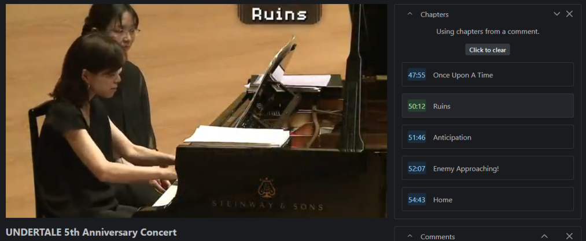
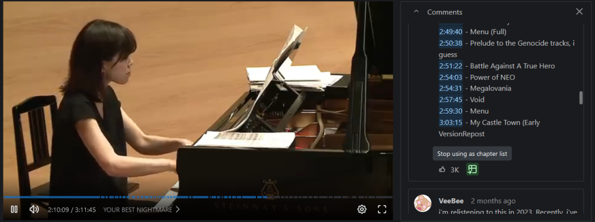
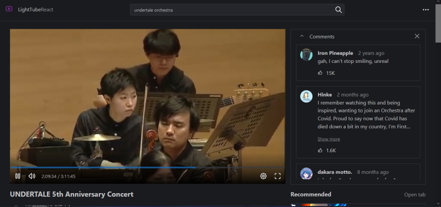
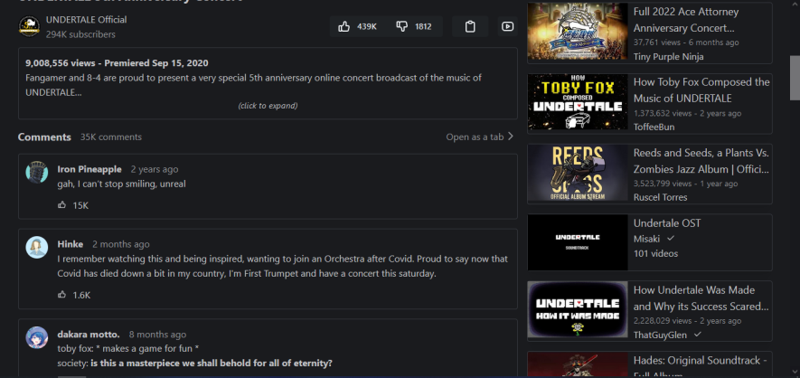
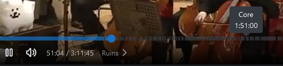
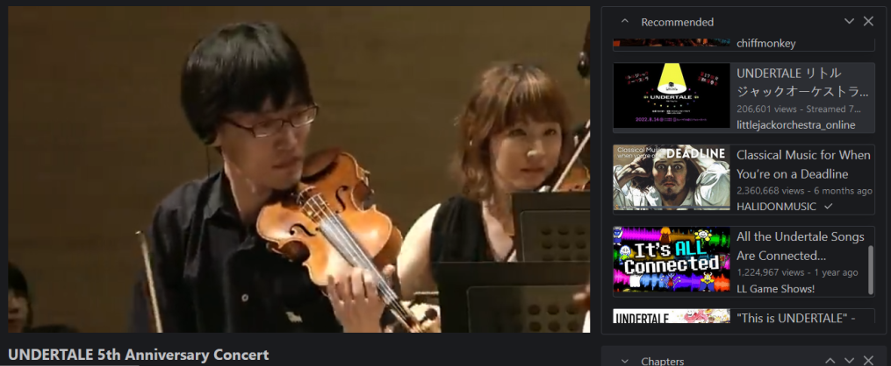
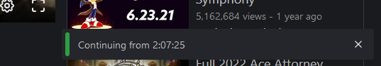
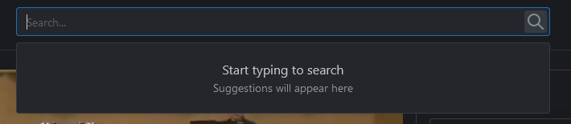
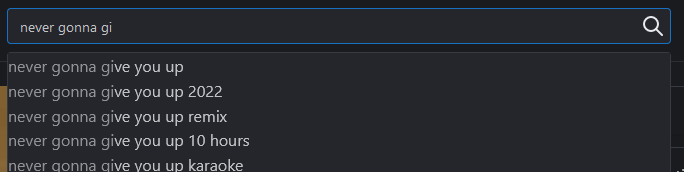
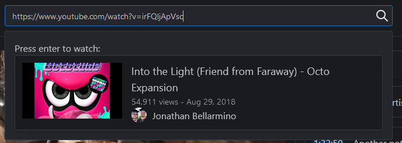
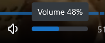

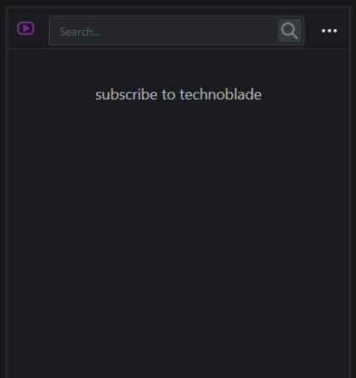
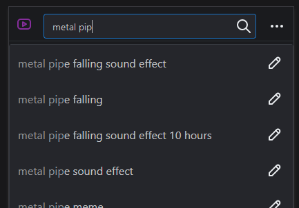
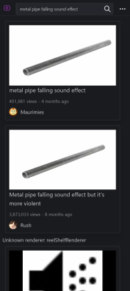
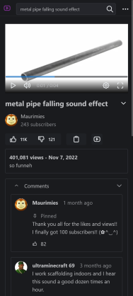
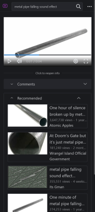
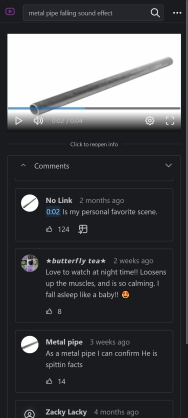
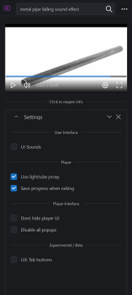

## TODO

- manual player format selection + auto format changer
- reel shelf renderers
- /playlist
- /channel
- Better Shorts/Reels
- Sponsorblock
- Custom Theming
- Custom Player Layouts
  - [like this](https://media.discordapp.net/attachments/931433557547700294/1084900495396700290/image.png?width=728&height=418)
  - [or this](https://media.discordapp.net/attachments/931433557547700294/1084899625720348722/image.png?width=713&height=418)
  - etc (those were failed attempts but they were cool)
